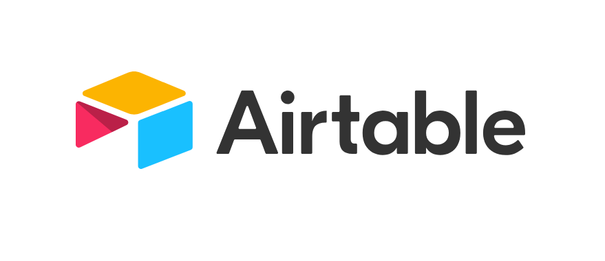

For a new side project, [Keming](https://keming.io), my partner and I needed to quickly validate interest in our product. To do so, we designed and built a landing page scoped to the following constraints:

1. Allow users to submit interest and personal data
2. Store this data safely, in an easily **accessible and manipulable** format
3. Retain control over all styling (no 3rd-party branding should be evident)
4. No server-side code
5. Completely static and easily deployable through [Netlify](https://www.netlify.com/)

As we are bootstrapping Keming, we did not have an immediate requirement for a fully-fledged backend - even a basic [Flask](https://github.com/pallets/flask) application felt like overkill. At the same time, we did not want to release with a [Google Form](https://www.google.com/forms/about/) as we hypothesized it would put-off our target market.

My initial thought was to create a form that submits to the [Google Sheets API](https://developers.google.com/sheets/api). Having consumed Google's API's for years, I believed this would be a straight forward experience as the quality of their API design and documentation is typically superb. The [documentation for Firebase](https://firebase.google.com/docs) is a salient example. However, I found the Google Sheets API documentation to be lacking and its implementation too complicated for such a simple project.

I briefly considered using Firebase as it is my standard for prototyping, but decided against it as. While it does provide an interface for accessing and manipulating data, this data would have to be accessed by non-technical persons and Firebase's UI-representation for its NoSQL DB can be frightening.

Furthermore, I wanted to scratch that itch to use a new API...

## Airtable

Enter [Airtable](https://airtable.com/). Thanks to clear API documentation, I had a solution up and running in less than 10 minutes.

Here is how easy it was to integrate [Airtable's npm package](https://www.npmjs.com/package/airtable) with a React form:

```javascript
// Form.js

const { REACT_APP_AIRTABLE_API_KEY, REACT_APP_AIRTABLE_BASE_ID } = process.env

const base = new Airtable({
  apiKey: REACT_APP_AIRTABLE_API_KEY,
}).base(REACT_APP_AIRTABLE_BASE_ID)

function onSubmit() {
  base('MyTable').create(
    {
      column1Title,
      column2Title,
      column3Title,
    },
    (error, record) => {
      if (error) {
        onError(error)
      } else {
        onSuccess()
      }
    }
  )
}
```

Thank you, Airtable, for the fantastic developer experience.
