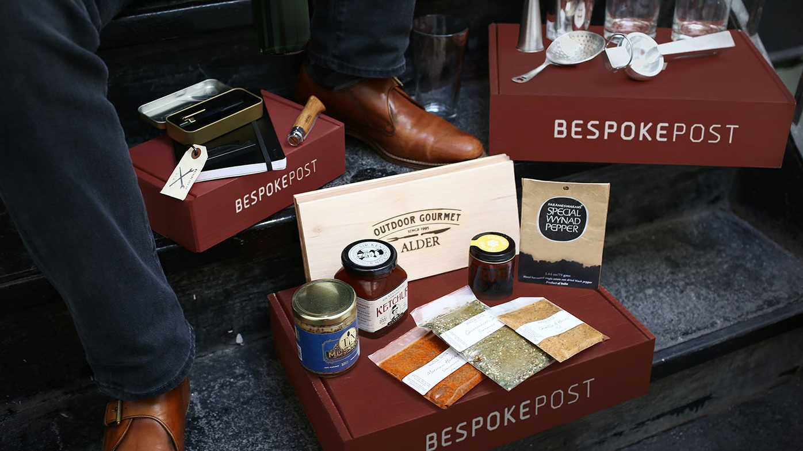
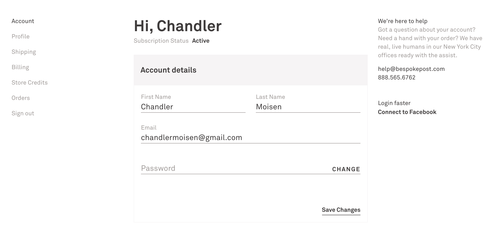
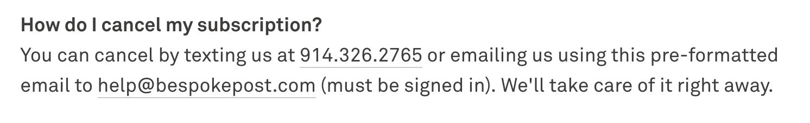
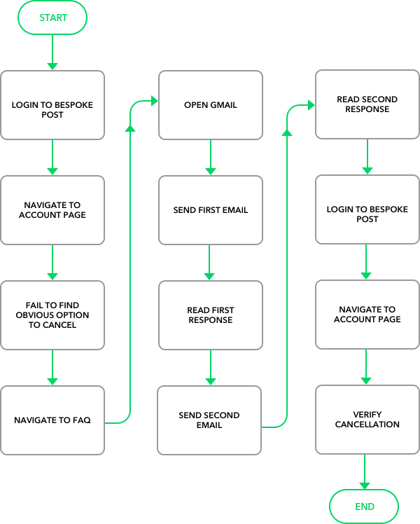

A notable takeaway from Dave Wascha's [20 Years of Product Management in 25 Minutes](https://www.youtube.com/watch?v=i69U0lvi89c&feature=share) is that companies often loose sight of their own mission and begin solving their own problems instead of solving their customers' problems.

It is the responsibility of the product organization to prevent such drift - to fight for the customer and ensure their problems are prioritized.

While there will always be a balance between stakeholders, customers should never take a back seat.

What follows is an example of a firm prioritizing their own problems.

## Bespoke Post

Earlier this year I signed up for [Bespoke Post](https://bespokepost.com) - a Birchbox-esque play aimed at men with an extra $60 to spend each month.

It differs from Birchbox in that it gives the user more control over what they receive.

At the start of each month, users are offered an array of boxes to choose from. If nothing catches the user's eye, they can opt-out of receiving a box that month.

Bespoke does pre-select a box for the user and gives them roughly a week to make a change or cancel the order.

This model can prove dangerous to users who are busy (in my case, forgetful) and do not cancel unwanted boxes.

While I was able to snag a few records, a nice brass pen, and an over-the-top [Pocket Samurai Keychain Knife](https://www.statgeartools.com/pocket-samurai-keychain-knife-aluminum-edition/), I forgot to cancel an order and ended up with a pair of rather unimpressive sunglasses.

Bespoke Post does offer free returns, but only for store-credit.

This minor lapse in my memory, the difficulty in making the return, and the ugly sunglasses spurred some personal financial responsibility and I set out to cancel my subscription.

## Cancellation Difficulties

There is a place in hell for firms that make it difficult for their users to cancel their service.

There is an understandable need for businesses to reduce churn and product teams should take all necessary measures to do so. That said, making it difficult for users to cancel your product should not be considered one of these measures.

Firms that subscribe to such a tactic are solving their own problems instead of their customers' problems.

Here is what I had to go through to cancel my Bespoke Post account.

Looking at Bespoke's user dashboard, you will see there is no obvious method to cancel:

I had to click through each menu option - "Account", "Profile", etc. - multiple times before I finally gave up and decided to check the "FAQ" at the bottom of the page:

That is right: I had to send a "pre-formatted email" to the Bespoke team informing them _in writing_ of my intent to cancel.

I will spare you the entirety of the email thread, but, as expected, this was not the only email I would have to send in order to cancel my subscription.

Here is the entire workflow for cancelling my Bespoke Post account:

So. Much. Friction.

It took me 12 steps (actually more considering I had to revisit GMail multiple times) and three days, but I was finally able to cancel the subscription.

Ironically, Bespoke Post does not provide an intuitive UI encouraging me to restart my subscription.

## Outcome

This stands as a case-study of solving your business problems instead of your customer problems.

Again, I understand Bespoke's need to reduce churn, but creating such a high level of friction in their UX does not help their customers. Such a strategy has an off-putting effect and makes it quite clear that Bespoke is putting their own interests in front of their customers' needs.

As an alternative, Bespoke Post should make the cancellation process as smooth as possible and then weigh following up with re-targeting, reasons-for-churn survey, etc. 

Still, I would be very curious to see an analysis between their current cancellation path and another path with less friction: one that allows users to easily cancel their subscription from within the UI (sans email thread with customer support).

I would imagine that Bespoke's target users are not hurting for the $60/month fee and that they value the random box of materials good each month over the level of effort required to cancel.
