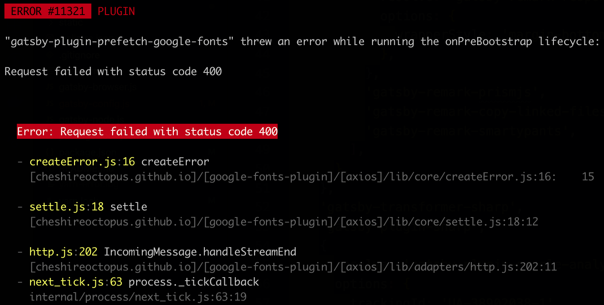

There are a number of ways to use [Google Fonts](https://fonts.google.com/) within a [Gatsby](https://www.gatsbyjs.org/) application. In other platforms, we could simply add `<link>` tags to the `index.html` file and call it day. However, as Gatsby generates the `index.html` during its build process, we are unable to modify the `index.html` file directly. As such, we have to find another way to inject Google Fonts.

A lot has already been written about [Typography.js](http://kyleamathews.github.io/typography.js/), so this post will compare the pros and cons of three other approaches:

1. The Link tag and React Helmet
2. The `gatsby-plugin-google-fonts` package
3. The `gatsby-plugin-prefetch-google-fonts` package

**Note**: this blog uses the third approach.

## 1. The Link tag and React Helmet

The most straight forward approach, and perhaps the approach most similar to placing the Google Font embed link within `<head>`, is to place the embed into a [React Helmet](https://github.com/nfl/react-helmet) component.

React Helmet is a library for managing all of the tags that are rendered within the document head.

If you used a [Gatsby starter](https://www.gatsbyjs.org/starters/), your project most likely already includes the `gatsby-plugin-react-helmet` library and you do not need to install React Helmet.

To implement this approach:

```javascript
// layout.js

import Helmet from 'react-helmet'

;<Helmet>
  <link
    href="https://fonts.googleapis.com/css2?family=Yeseva+One&display=swap"
    rel="stylesheet"
  />
  <link
    href="https://fonts.googleapis.com/css2?family=Open+Sans:ital,wght@0,400;0,700;1,400&display=swap"
    rel="stylesheet"
  />
</Helmet>
```

**Note**: place this component in a top-level container so that it gets included across the application

### Pros

1. Straight-forward and familiar if you are new to Gatsby

### Cons

1. Flash of Invisible Text (FOIT) as the external resource is loaded
2. Hard-codes fonts instead of relying on Gatsby's configuration

## 2. `gatsby-plugin-google-fonts`

`gatsby-plugin-google-fonts` makes use of Gatsby's plugin ecosystem and configuration to load Google Fonts. In other words, instead of hard-coding your `link` embeds as in the prior approach, you instead would set them within your `gatsby-config.js` file:

```javascript
// gatsby-config.js

{
  resolve: 'gatsby-plugin-google-fonts',
  options: {
    fonts: [
      'yeseva one',
      'open sans\:400,400i,700',
    ],
    display: 'swap',
  }
}
```

**Note**: the syntax to load multiple font variants is interesting

### Pros

1. Leverages Gatsby's plugin ecosystem
2. Keeps configuration within the appropriate config file

### Cons

1. FOIT as the external resource is loaded

## 3. `gatsby-plugin-prefetch-google-fonts`

Similar to previous approach, `gatsby-plugin-prefetch-google-fonts` also leverages Gatsby's configuration settings, but, please be advised:

**THIS PLUGIN IS NO LONGER SUPPORTED BY ITS AUTHOR!**

Which is quite unfortunate as it avoids the FOIT that both of the previous approaches suffer from.

The Flash of Invisible Text is the result of the browser waiting to load the external font resources while the page loads. While this issue can be mitigated using the `font-display` property, there will still be the slightest flicker as the browser's fallback font is replaced with the Google font. To read more about FOIT and `font-display` go [here](https://fontsplugin.com/google-fonts-font-display-swap/).

That said, if you are comfortable using an unsupported library and want to avoid the flashing text issues, then this approach is for you. `gatsby-plugin-prefetch-google-fonts` works by prefetching the font resources during Gatsby's build process and including these resources in your build.

To use the plugin, add it to your `gatsby-config.js` file:

```javascript
// gatsby-config.js

{
  resolve: 'gatsby-plugin-prefetch-google-fonts',
  options: {
    fonts: [
      {
        family: 'Yeseva One',
      },
      {
        family: 'Open Sans',
        variants: ['400', '400i', '700',]
      },
    ],
  },
},
```

### Build Errors

Please note that you must correctly capitalize the font family in the configuration file otherwise your build will fail.

For example, comparing `'Open Sans'` vs. `'Open sans'` - the lower-cased `sans` will cause the prefetching to fail and the following error to show during the build:



### Pros

1. Avoids the FOIT as resources are included in the Gatsby build
2. Leverages Gatsby's plugin ecosystem
3. Keeps configuration withing the appropriate config file

### Cons

1. Unsupported library
2. Potential for build errors
3. Unsupported library

## Conclusion

If you made it this far, you just learned three approaches to loading Google Fonts within a Gatsby application.

The blog that you are reading this on uses the third approach as I like to include the the font resources in the build to avoid fetching them when the document loads causing flashing text.
