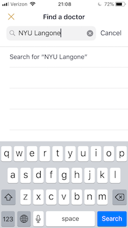
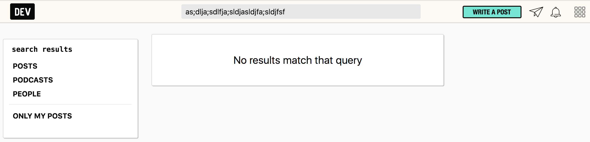
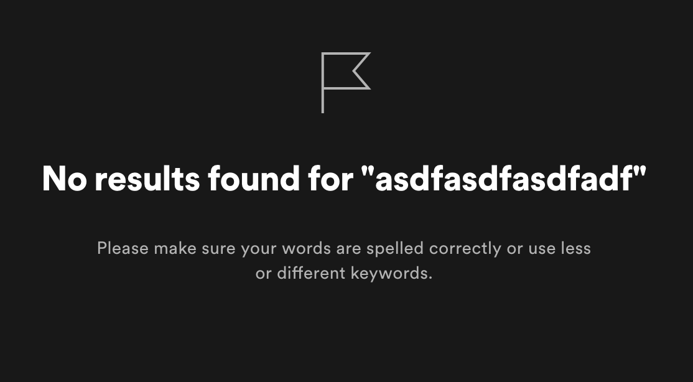
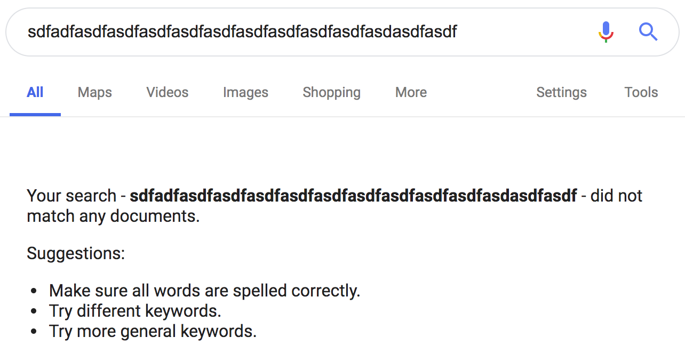
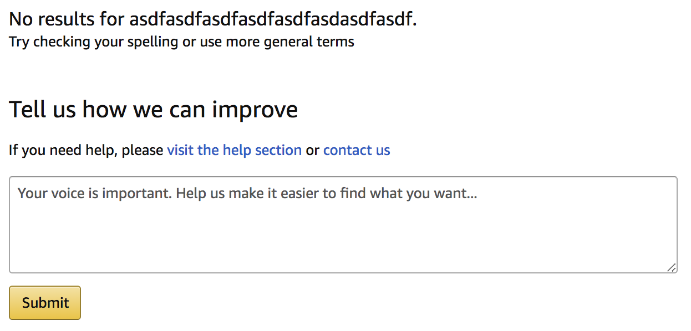

In an effort to bring order to the chaos that is transferring medical records between doctors, I recently signed up for [Galileo Health](https://galileohealth.com/).

Purporting to simplify management of personal electronic health records, Galileo also helps users schedule simple check-ups, renew prescriptions (that are not controlled substances), request lab work, and other tedious personal health tasks.

## Overlooking Emptiness

While the Galileo application has a nice user experience overall, the search functionality leaves a bit to be desired.

This is the result of searching for the NYU Langone hospital system:

Just a nebulous empty-state containing the text: _Search for "NYU Langone"_ - an action which I believed had just occurred.

Galileo can be forgiven for not having every single doctor and hospital available on their platform, but they should be taking advantage of this empty-state to give the user better feedback.

This got me curious to how other products display empty search results.

## The Art of Being Empty

### Clear Copy

At the very least, users need an unequivocal response that their search has not returned any results.

The developer-focused blogging platform [dev.to](https://dev.to) does this well:

### Simple Suggestions

Even better, add some light copy to encourage the user to try different approaches to their search as we see with [Spotify](https://spotify.com):

[Google's search](https://google.com) renders a similar empty-state:

### Actionable

My favorite empty-state is [Amazon's e-commerce search results](https://amazon.com).

Not only is the user provided with clear copy and simple suggestions on how to alter their search, but Amazon also affords the user the opportunity to provide valuable feedback:

Whether users are actually using this feature is another question...
