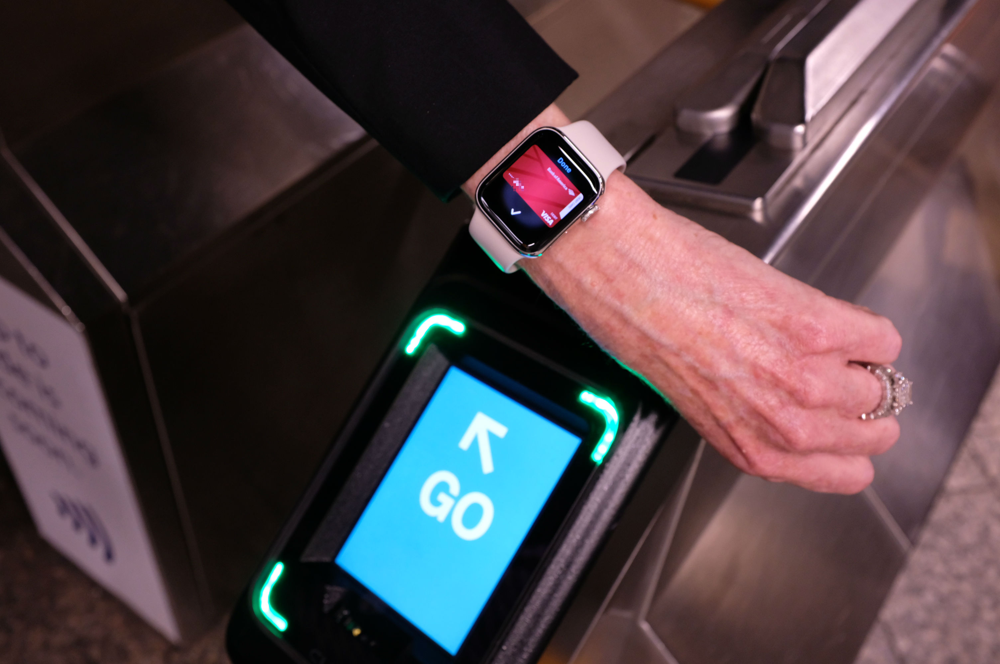
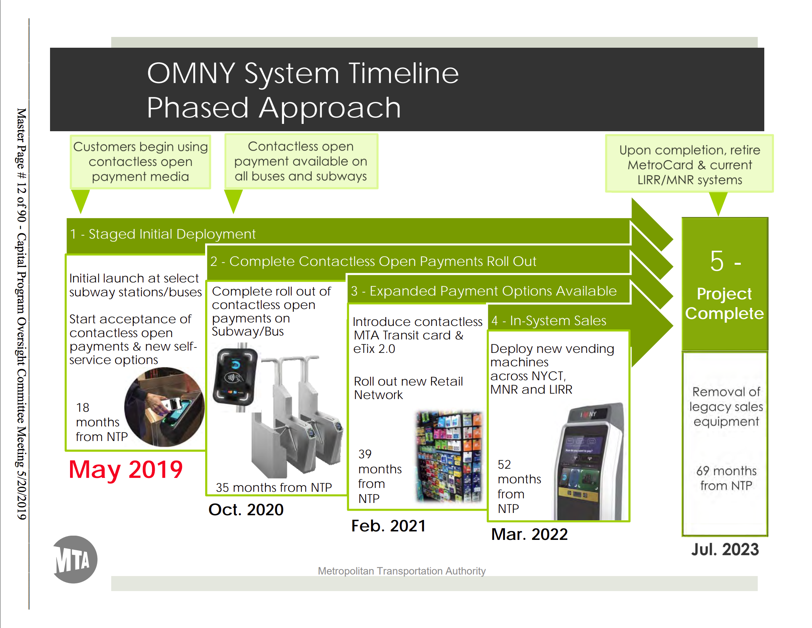
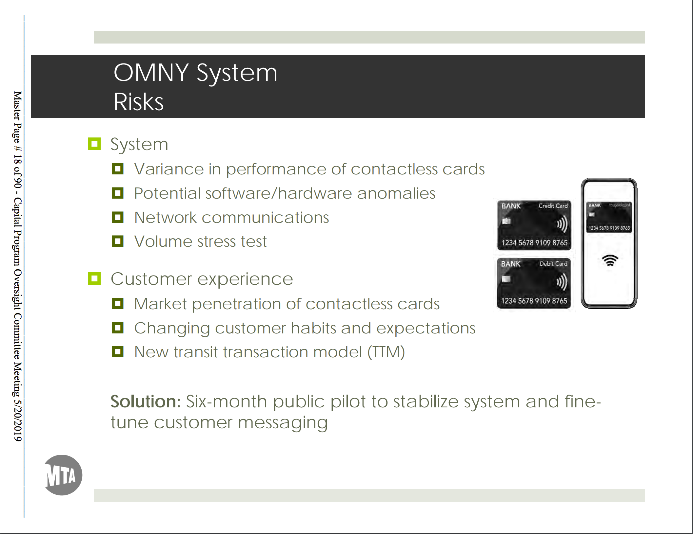
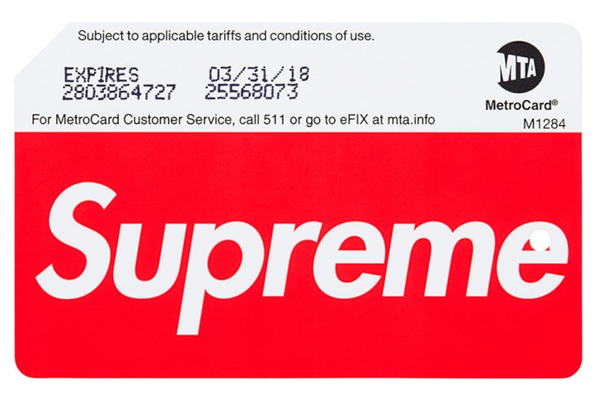

For those of us in the center of the universe, the New York City MTA has finally unveiled [support for contactless payments](https://techcrunch.com/2019/05/31/nycs-contactless-subway-turnstiles-open-today-with-apple-google-samsung-and-fitbit-pay-support/).

Long awaited - Chicago has had [contactless payment since 2013](https://www.ventrachicago.com/) - the new [OMNY](https://new.mta.info/system_modernization/omny) (One Metro New York) payment system went live last Friday across select transit lines.

Given the sheer scale of the MTA's infrastructure and the number of customers it serves, there are a number of learnings to be had from how the MTA is releasing OMNY to the general public.

## Phased Approach

Similar to how the MTA overhauled its payment system from 1992 to 2003 as it migrated from tokens to magnetic stripe cards, OMNY is expected to be implemented in phases and not complete until 2023.

This makes sense as retooling the entire system and enabling it all at once would be prime for disaster.

Witness the embarrassment Chicago suffered when it took this very approach with the [launch of its contactless payment system, Ventra](https://www.chicagotribune.com/news/ct-xpm-2013-12-30-chi-ventra-failures-cost-cta-12-million-in-free-rides-20131230-story.html). A computer issue knocked a considerable number of card readers offline and roughly **one million** rides were given away during the first weeks after launch.

Furthermore, Chicago failed to adequately prepare its citizens for the update:

> Thousands of Chicago Card customers did not receive Ventra cards in the mail, and many of those who did either didn't receive activation instructions via email or they misplaced the emails in the long span between receiving the emails and their Ventra cards.

Even worse:

> Myriad other problems followed, including customers being double-charged for rides using Ventra cards; deposits to Ventra accounts failing to be properly credited; and Ventra card readers deducting fares from other contactless cards in riders' wallets or purses.

Thankfully, the MTA has been able to learn from Chicago's mistakes and is rolling OMNY out much like you'd expect enterprise software to be released:

1. Small, internal test with a few dozen workers
2. Slightly larger, still internal test with 1,500 workers
3. ["Deliberatley small"](https://www.amny.com/transit/metrocard-replacement-omny-1.29297988) public pilot at just a few stations
4. A customer support team has been set up at 511 to handle OMNY-related questions

## OMNY Risks

It is also interesting to see what risks the MTA has called out surrounding the OMNY release:

Beyond addressing out salient technical issues, many kudos to the MTA for having a bullet point dedicated to "Customer experience" and that they are actively working to address something as difficult as "Changing customer habits and expectations".

## Other UX Considerations

Here are a few other UX considerations the MTA should consider while it continues to release OMNY:

### Fare Evasion

Just as the magnetic stripe cards put an end to [token sucking](https://www.nytimes.com/1983/02/07/nyregion/youths-stealing-subway-tokens-by-sucking-on-turnstile-slots.html), how will contactless payments impact fare evasion?

<!-- > Cubic’s contactless reader can decide whether to let a rider through in 500 milliseconds, according to Brunner. That’s nearly as fast as the blink of an eye, or a heartbeat. The seamlessness of contactless pay will hopefully reduce fare evasion, as well. “People say they jump the turnstile because they swipe the card, realize they don’t have enough fare, and the train’s coming,” said Brunner. “Now that you can pay with your credit card, there’s no problem of ‘Oh, I don’t have any fare, I need to go back to the booth.’” -->

### "Swipe it forward"

Riders with unlimited weekly/monthly passes have been encouraged to "swipe it forward" for low-income residents when exiting the station - will this practice continue?

### Vanity Cards

Lastly: as the magnetic stripe cards are phased out, we will also loose out on hustling for vanity cards:

There is no way to flex with contactless payments...

<!-- ## Initial Response -->

<!-- * https://www.nydailynews.com/new-york/ny-omny-data-first-weekend-20190603-75yetlc5dbevlhhri4c3ypr2wy-story.html
* The average time for a tap to register at a turnstile was a half-second
* Fewer than 5% of riders had to tap twice to get through. As riders get used to tapping instead of swiping MetroCards, the number of double taps will fall, the MTA expects.
* Unexpected source of data: "It appears to be popular with tourists — an MTA spokesman said the agency tracked taps by riders from Europe, South America, the Middle East and Asia."
* Follow up to data: https://www.nytimes.com/1997/08/11/nyregion/what-galls-a-hacker-most-the-metrocard.html?mtrref=undefined -->

<!-- * Pretax transit benefits?
> Meanwhile, commuters who sign up for pretax transit benefit programs through their employers learned that the information provided to Ventra isn't secure. Human resources administrators who tried to log in to their company's account kept getting other companies' pages.
* Allow users to use the same payment method across all transit options - subway, rail, or bus
* Fare-capping policies? Impact on weekly / monthly fares? Sydney's Opal card removed their weekly option, London's oyster card, too -->
