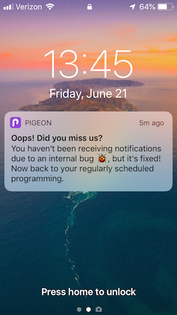

I rely on [Pigeon](https://pigeon.area120.com/) to navigate the mess that is the New York City Subway.

You can think of Pigeon as the [New York City Subway's Waze](https://www.theverge.com/2018/5/31/17414330/google-area-120-pigeon-nyc-subway-app). Sprouting from an incubator within Google, Pigeon crowdsources train alerts and notifies users when the subway lines they commute on are experiencing delays.

While I could expound Pigeon's UI and features, something they recently did struck me as notable:

Pigeon sent me a notification that they had messed up!

Owning your mistakes - especially for something as insignificant as not sending a few mobile notifications - is not a pattern I see all that often.

What comes to mind is more _forced_ corporate responsibility around product safety and PII breaches:

* Equifax forced to [notify the authorities](https://www.ftc.gov/equifax-data-breach) about a massive data breach
* Apple forced to [recall their 15-inch Macbook Pro](https://support.apple.com/15-inch-macbook-pro-battery-recall) due to battery fires
* Facebook's forced to [apologize for privacy concerns](https://www.youtube.com/watch?v=Q4zd7X98eOs)

While you could make the argument that Apple is taking active measures to ensure customer safety, both Equifax's and Facebook's ownership of mistakes come off as disingenuous and with misplaced intention.

Pigeon's product team took a gamble with owning their notification bug. From my perspective, their ownership endears me to their product.

Will be on the look out for the pattern of owning one's mistakes elsewhere.
