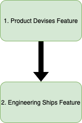

When I began my career as a software engineer, I suffered the misconception that software development was a straight-forward, unidirectional, two-step system:

This misconception led to a series of pernicious beliefs in how I approached daily work.

### Pernicious Belief 1: Shipping == Value

Engineering is only responsible for shipping as shipping is the most visible mechanism for realizing an engineering's value. An engineer's value to the organization is worthless until they smashed that "Merge pull request" button.

### Pernicious Belief 2: Engineers Are Paid to Code

The majority of an engineer's time should be spent inside their IDE. After all, this is why engineers are paid: to produce text files full of variables and functions that, taken together, comprise a feature that product determines valuable. Anything beyond the scope of code is the domain of product.

### Pernicious Belief 3: Say "Yes"

Pushing back against the straight-forward, unidirectional, two-step system is akin to heresy. The product team understands the problem the best and engineering is there to build product's vision. Engineers are supposed to say "yes".

## The Ease of "Yes"

As a software engineer, you are inclined to code. There is a lot of pressure to ship and "deliver value". Product is always looking to move forward on their roadmap. Users are always waiting for new features and bug fixes. It becomes extremely easy to say "yes" to everything - especially when you align shipping with value.

Yet, there are few pitfalls to being so amenable. By constantly saying "yes" you:

1. Treat the product organization as a boss instead of a teammate
2. Surrender your personal input on the product's vision
3. Fail to ask why a feature should be built
4. Most likely ship WRONG features
5. Unintentionally signal your apathy or, worse, laziness

Such an approach is the path of least resistance when it comes to software development. It is hard to step back, thoroughly assess a proposal, and say "no".

## The Challenge of "No"

It can be difficult for engineers to say "no" to features as they are ostensibly paid to build features. Saying "no" means value will not be delivered; it interferes with product's roadmap and planning; it might nullify significant design resourcing or another team's investment.

Saying "no" can be difficult especially when senior leadership is driving an initiative. Attempting to stop such organizational momentum probably appears more troublesome than it is worth.

It takes confidence to say "no - this feature is not worth it".

But, the first time you do, and successfully argue why, you will want to say it more often. Saying "no" means you have taken an active role in the product roadmap and are asking why features should be built. Saying "no" means you believe the return a feature promises does not justify the cost of its implementation. Saying "no" means you care about your product, your team, and your users.
