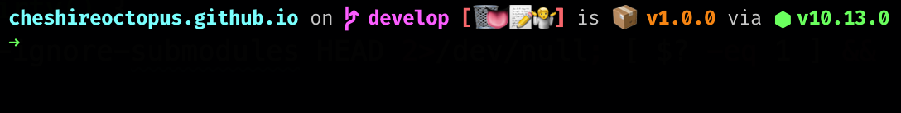

I have always wanted a tricked out command prompt, but have never invested much time in bash scripting aside from some simple functionality around git and slight modifications to my prompt:

```bash
# Check if repo is dirty
function parse_git_dirty() {
  git diff --quiet --ignore-submodules HEAD 2>/dev/null; [ $? -eq 1 ] && echo '*'
}

# Branch name
function parse_git_branch() {
  git branch --no-color 2> /dev/null | sed -e '/^[^*]/d' -e "s/* \(.*\)/\1$(parse_git_dirty)/"
}

# Prompt 1: "username:"
#PS1 is an environmental variable
PS1="\e[38;5;201m\u\e[0m ✌ :"

# Prompt 2: "path/to/where/you/are"
PS1="$PS1\e[38;5;57m\w\e[0m"

# Prompt 3: "(gitbranch)"
PS1="$PS1 \$([[ -n \$(git branch 2> /dev/null) ]] && echo \" \")\[\033[1;33m\]\$(parse_git_branch)\[\033[1;37m\]\n\$ \[$(tput sgr0)\]"
```

Luckily for me I recently came across [Starship](https://starship.rs/) - "the minimal, blazing-fast and infinitely customizable prompt for any shell!"

Here is what my prompt looks like after setup and some basic configuration:



Besides being incredibly simple to setup and get going, the customization aspect via a `.toml` file

```bash
[character]
symbol = "➜"

[git_status]
conflicted = "🏳"
ahead = "🏎💨"
behind = "😰"
diverged = "😵"
untracked = "🤷<U+200D>"
stashed = "📦"
modified = "📝"
staged.value = "++"
staged.style = "green"
staged_count.enabled = true
staged_count.style = "green"
renamed = "👅"
deleted = "🗑"
```
