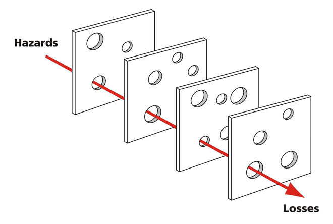

_I set aside 30 minutes at the end of each work day to reflect on something that I learned or found interesting during the day. I am making an attempt to write these down._

____

Today I learned about the [Swiss cheese model of accident causation](https://en.wikipedia.org/wiki/Swiss_cheese_model).

The idea is that you can analyze threats to a system by breaking the system into steps. While each step will undoubtedly have holes representing failures in that particular step of the system, because the next layer of the system does not have a hole in the same place, a threat is not able to pass beyond that  layer.

Threats to a system thus arise when layer after layer has a hole in the same place:

What I like about this approach is that it considers failure to be systemic as opposed to being the cause of one particular individual. In recent years, technologists have adopted a similar approach with the [blameless post-mortem](https://codeascraft.com/2012/05/22/blameless-postmortems/).

If you have spent more than a few minutes working in technology you know you are destined to encounter failure within in your systems be it due to your code, your colleagues' code, third-party vendors' code, network issues, some manual process that only one person knows how to perform, or one of the countless other points of failure.

Failure in software is part of the game and controlling for it represents a lot of what we do. That said, as technologists, we get to decide how we respond to failure. Do we blame the individual who happened to click the wrong button at the wrong time? Or, do we blame the system as a whole and analyze what enabled the person to click the wrong button in the first place?

