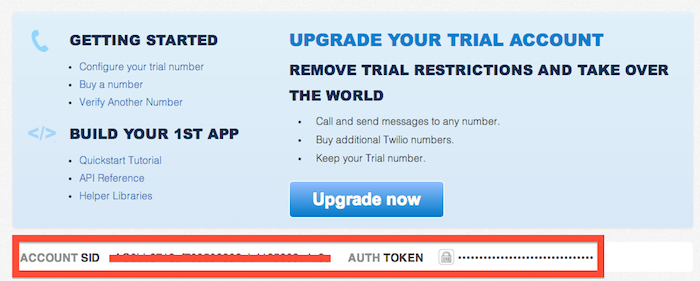
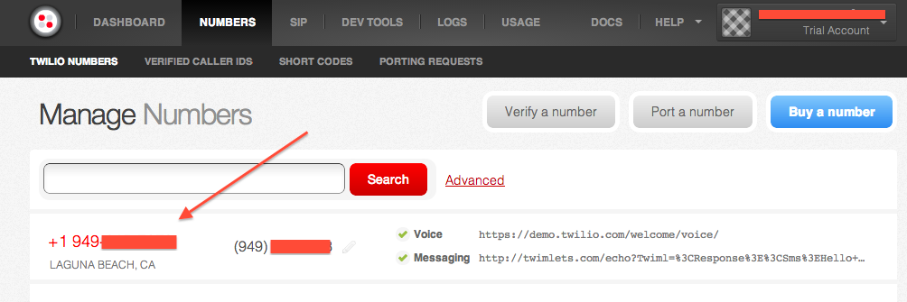
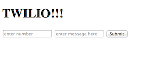
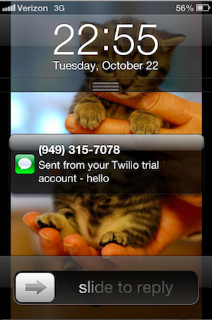

[Twilio](https://www.twilio.com/) is an awesome platform that makes it super easy to add SMS, voice, and VOIP functionality to your web applications.

This tutorial will show you how to set up an extremely simple Ruby on Rails application that uses Twilio to send SMS messages from your browser. It’s probably best that you have a basic understanding of RoR.

---

## Twilio Setup

**1:** [Sign up](https://www.twilio.com/try-twilio) for free using a telephone number that you have access to – preferably your cell – as you will have to verify your account via SMS.

**2:** Twilio will automatically generate a telephone number for you. In my experience, these generated numbers are issued with the same area code as the original number you signed up with. **Note:** you can customize your number if you so wish.

After you’ve made it through the login, you should be welcomed with this screen:



Make a note of both the **ACCOUNT SID** and the **AUTH TOKEN** – you will need both of these later. To see the latter, click on the lock to view it.

**3:** I like to save my Twilio numbers in my cell because I have a terrible memory. As you can guess, I often forget to do even that. Visiting the ‘Numbers’ pane on the Twilio dashboard – pictured below – provide them for you.



---

## Rails Setup

**1:** First, create the Rails application, in this case thought-provokingly named ‘twilio_app’. We don’t need the `index.html` that Rails so graciously provides – toss it, you don’t need that noise.

```bash
#bash

$ rails new twilio_app
$ rm public/index.html
```

**2:** Twilio compiled a gem which makes Rails integration realtively painless. Check out the [documentation](http://twilio-ruby.readthedocs.io/en/latest/) and add it in the Gemfile. Make sure to bundle!

```ruby
#Gemfile

gem 'twilio-ruby'
```

**3:** Next, we will generate a controller which will be responsbile for making sense of our app’s requests and producing the appropriate output. **Note:** this method of controller generation creates a bunch of extra files you do not need for this application, but it’s easy.

```bash
#bash

$ rails g controller twilio
```

**4:** In the controller you just created, add a method `send_sms` which will send the SMS’s. We will come back to this in a moment.

```ruby
#twilio_controller.rb

class TwilioController < ApplicationController

  def send_sms
  end

end
```

**5:** We’re making headway on the backend, but we need do some barebones frontend functionality. Create a file `index.html.erb` that your Twilio controller has access to. Make sure this file is located in the following directory: `twilio_app/app/views/layouts`. In this file we are going to create a simple form which will allow the user to input a phone number and a message. Make sure the form’s action directs to `/send_sms` and the method is `POST`.

```ruby
<%# index.html.erb %>

<h1>TWILIO!!!</h1>

<%= form_tag('/send_sms', method: 'POST') do %>
	<input type="text" placeholder="enter number" name="number">
	<input type="text" placeholder="enter message here" name="message">
	<button type="submit">Submit</button>
<% end %>
```

Your `index.html.erb` should look like this:



**6:** Now that we’ve made our view and controller, let’s connect them via `routes.rb`. Clear out the comments in the `routes.rb` file, build a root path that directs to `index.html.erb`, and then another path that will post the information from the form we just built to the `send_sms` method in the Twilio controller.

```ruby
#routes.rb

TwilioApp::Application.routes.draw do

  root :to => 'twilio#index'
  post '/send_sms' => 'twilio#send_sms'

end
```

**7:** Alright, last step. Do you still remember your **ACCOUNT SID**, **AUTH TOKEN**, and **Twilio phone number**? We’re going to add these to our Twilio controller’s `send_sms` method to enable our application to send texts.

I’ll show you my code, then walk you through it line by line.

```ruby
#twilio_controller.rb

class TwilioController < ApplicationController

	def send_sms
		message = params[:message]
		number = params[:number]
		account_sid = 'XXXyour account sid should be hereXXX'
		auth_token = 'XXXyour auth token should be hereXXX'

		@client = Twilio::REST::Client.new account_sid, auth_token
		@message = @client.account.messages.create({
			:to => "+1"+"#{number}",
			:from => "+12813308004",
			:body => "#{message}"
		})
		redirect_to '/'
	end

end
```

**Line 1:** Opens the TwilioController

**Line 3:** Defines the `send_sms` method

**Line 4:** Takes the message input from the form in `index.html.erb` as a paramater and assigns it to the variable ‘message’

**Line 5:** Takes the number input from the form in `index.html.erb` as a paramater and assigns it to the variable `number`

**Line 6:** Stores your **ACCOUNT_SID** as a variable

**Line 7:** Stores your **AUTH_TOKEN** as a variable

**Line 9:** Instatiates a Twilio Rest Client as `@client`, which stores the authentication parameters on lines 6 and 7 (account_sid and auth_token, respectively), and enables the `send_sms` method to make HTTP request to Twilio. [More info…](http://www.rubydoc.info/github/twilio/twilio-ruby/Twilio/REST/Client)

**Line 11-13:** Creates a message, stored as the variable `@message`, which takes a hash as an argument. The hash should include: `:to`, `:from`, and `:body`. `:to` interpolates the variable number, and represents the recipeint of the SMS. `:from` should be your Twilio number stored in the following format: `+12813308004`. `:body` interpolates the message variable which contains the message entered on `index.html.erb`.

**Line 14:** After the SMS is processed and sent, this redirects the user back to the root directory, or, in our case, `index.html.erb`.

---

## Outcome

Assuming the code is correct, run the application locally and send yourself a message.

If everything works out, you should be able to send SMS messages from your browser!



---

## Caveats

As this application was developed using Twilio’s free service, you can only send texts to the phone number that you verified your Twilio account with. To mess with your friends, activate your Twilio account by adding a credit card. Individual texts cost less than \$.01.

---

## Next Steps

One day I will write a follow up, but for now, check out this [github repo](https://github.com/crtr0/twilio-rails-demo) for an idea of where else you can take Twilio and Rails.
