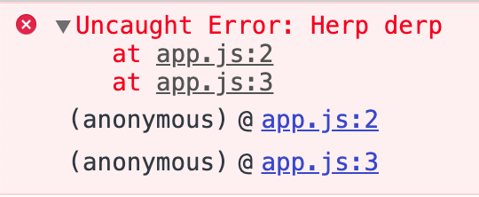

Today I learned that you should export named components as opposed to anonymous functions.

Came across the following tweet in my company's frontend chat this morning:

<blockquote class="twitter-tweet"><p lang="en" dir="ltr">If you write &quot;export default () =&gt; { ... }&quot; to declare components, they:<br><br>- will show up as Anonymous in stack traces<br>- will show up as Unknown in DevTools<br>- won&#39;t be checked by React-specific lint rules<br>- won&#39;t work with some features like Fast Refresh<br><br>Give components names!</p>&mdash; Dan Abramov (@dan_abramov) <a href="https://twitter.com/dan_abramov/status/1255229440860262400?ref_src=twsrc%5Etfw">April 28, 2020</a></blockquote>

Thankfully, I have been naming my default exports ever since a colleague commented on a pull request that including a name made it easier for them to search for the component in their IDE.

Yet, I must admit, while I was aware that anonymous functions would show up as `anonymous` in a stack trace, I never once gave thought to how this behavior would translate to exporting an anonymous function by default. Further, I never considered the implications of this when it comes to exporting React components!

If you haven't come across how the browser console displays an anonymous function's stack trace, you can easily demo this using an immediately-invoked function expression. Executing the following code:

```js
;(function() {
  throw new Error('Herp derp')
})()
```

would yield the following in your browser's console:


