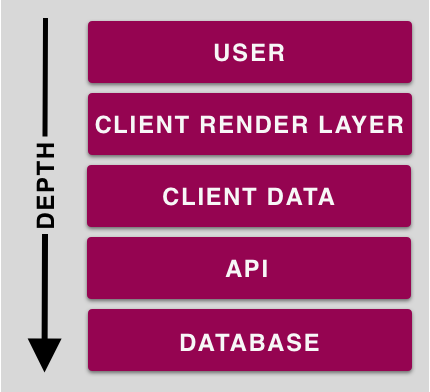

Today I learned the concept of __mocking low and asserting high__.

When it comes to testing software you are often weighing test-fidelity against time spent writing and maintaining tests. In other words: how aggressive your tests are vs. how much time you have.

In an ideal world, we are able to write beautifully expansive end-to-end tests that cover each and every edge case and still have plenty of time left over to develop new features. For many of us, this ideal world remains beyond reach due to resourcing and the laws that govern space and time.

We are thus forced to make compromises. An approach to structuring your compromise can be found in the concept of mocking low and asserting high.

Assume we are testing a technology stack consisting of a database, an API, a client data layer (responsible for fetching and parsing server responses), a client rendering layer (think: React), and finally how a user is engaging with this application. You could model this stack by "depth" where the database is the deepest level of the stack and the user is at the top:

The strategy here is to test as many layers of the stack as possible as cheaply as possible.

To do so, mock as "low" in the stack as possible while asserting as "high" in the stack as possible.

In this example we would mock the responses from the API (near the bottom of the stack) and assert what the user sees (at the top of the stack).

This approach favors testing what the user sees over implementation and is a good compromise to writing quality test.
