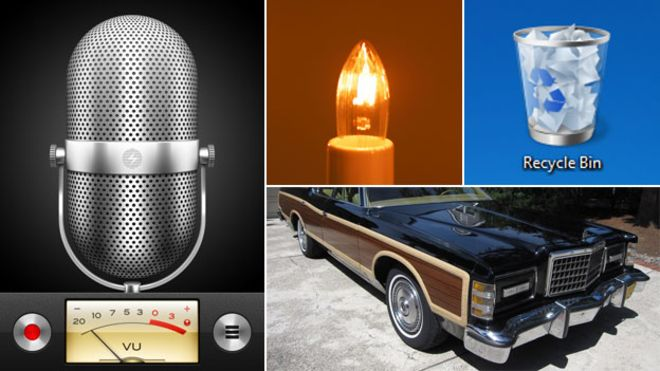

Today I learned what neumorphism is.

Well, rather, I finally learned what this design trend I have been seeing for months on my [Muzli](https://muz.li/) feed is called.

The term is a weak portmanteau of "new" and "skeuomorphism" - a design pattern where elements of a graphical user interface imitate their RL equivalent in either appearance or interaction.

Neumorphism is a visual design pattern where shadows are used to create the illusion of extruding shapes. These extrusions share the same coloring as their parent element.

You can see an example of this technique using this [generator](https://neumorphism.io/#950451).

As I am but a fledging designer, I lack the vocabulary to accurately critique this pattern, but it reminds me of pressing a shape through one of those elastic exercise bands. While certainly eye-catching, I am not sure of its applications in UI design as it makes all elements resemble button and would likely confuse users on what exactly they are supposed to interact with.
