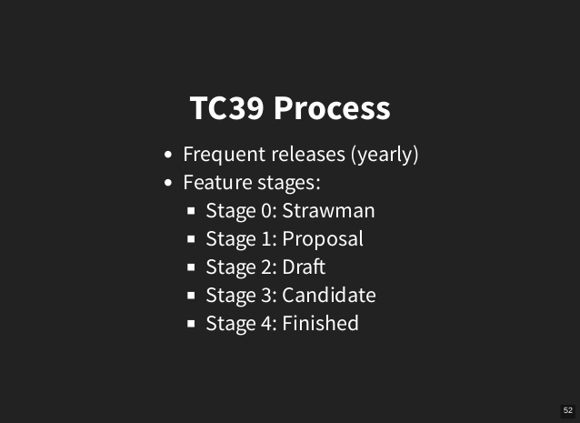

In case you haven't heard the news, Daniel Ehrenberg and Jeff Morrison's [ESnext class features for JavaScript](https://github.com/tc39/proposal-class-fields) proposal was moved from [stage-2 to stage-3](https://github.com/tc39/proposal-class-fields/commit/5a4ff5fa4bf30885188279f6fb8070f2e1903c32).

Yes.

This is especially great news for anyone who has been using BabelJS's [`transform-class-properties`](https://babeljs.io/docs/plugins/transform-class-properties/) plugin, as we no longer have to worry about the proposal dropping and the crises of conscious that would haunt us as we debate brining our React components back in line with standards.

If you are unfamilar with React and ES6+ class properties, check out this [fantastic article](https://babeljs.io/blog/2015/06/07/react-on-es6-plus) noting some of the highlights.

tl;dr - we go from this:

```javascript
	const MyComponent = React.createClass({
		propTypes: {...},
		getDefaultProps: function() {
			return {...}
		},
		getInitialState: function() {
			return {...}
		},
		render: function () {...},
	})
```

to this:

```javascript
	const MyComponent = class extends React.Component {
  		static propTypes = {...}
	  	static defaultProps = {...}
		state = {...}
		render() {...}
	}
```

However, even as we all eagerly await BabelJS's maintainers to move `transform-class-properties` from the [`stage-2`](https://babeljs.io/docs/plugins/preset-stage-2/) to [`stage-3`](https://babeljs.io/docs/plugins/preset-stage-3/) preset, if you are using [Airbnb's JavaScript Style Guide](https://github.com/airbnb/javascript), you will have to wait a little longer until your linter stops yelling at you for using class properties.

[Jordan Harband](https://twitter.com/ljharb), dev at Airbnb, states that we can use the new feature

> ["as soon as eslint core supports it - sadly they aren't likely to do so until stage 4."](https://github.com/airbnb/javascript/issues/1521#issuecomment-322267012).

Bummer.

If, like me, you simply cannot write React components without the new JS class properties, but rely on Jordan and team rest of the team at Airbnb to keep your JS in check, have no fear - a workaround does exist.

Simply add the [`babel-eslint`](https://github.com/babel/babel-eslint) parser - this allows you to use all valid Babel code, even that which might not be supported by ESLint.

Once installed, updated your `.eslintrc` file with the new parser:

```json
	{
		"extends": "airbnb",
		"parser": "babel-eslint",
	}
```

Happy JavaScripting.


